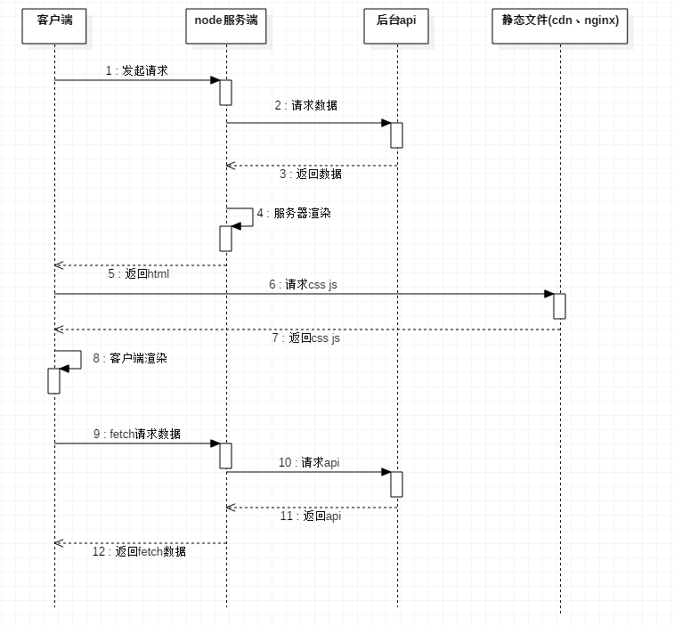

# react ssr

## how to run

```
npm i

npm run dev

npm run build

npm run start
```

## 服务器渲染 SSR (Server-Side Rendering)

### 什么是 SSR

通常我们使用 react，浏览器下载最小的 html 页面，内容通过 js 去填充。
使用 SSR，初始化的内容在服务器生成，浏览器下载已经有内容的 html 页面，更新内容在浏览器客服端。

### SSR 解决了什么

- SEO
- 提高性能
- 同构

#### SEO

除了 google，其他的搜索引擎不能爬取 js

#### 性能

初始化渲染在服务器，提高了性能，因为浏览器初次加载，需要下载很多 js，但是响应浏览器需要更多的时间，生成更多的内容，相对来说，可以忽略这点。服务器需要做 js 缓存。

#### 同构

浏览器和 node 跑的是同一份代码，react-router 和服务器的路由需要相同。

## 搭建项目

- react
- react-router
- redux
- webpack
- koa2

### [koa2](https://koajs.com/)

```js
const Koa = require("koa");
const app = new Koa();

app.use(ctx => {
  ctx.body = "Hello World";
});

app.listen(3000);
```

```
mkdir react-ssr & cd react-ssr
npm init

npm i koa --save
```

使用 es6
babel-polyfill

index.js

```
require('babel-polyfill')

require('babel-register')({
    presets: ['es2015', 'react', 'stage-3'],
    plugins: ['add-module-exports']
})


const app = require('./app.js')

app.use(ctx => {
  ctx.body = 'Hello World'
});

const port = 3000

app.listen(port,()=>{
	console.log('server started, bind port %d',port)
});
```

app.js

```
import Koa from 'koa'

const app = new Koa()

export default app
```

koa-views
ejs 模版
koa-logger 日志

nodemon 修改 nodejs 代码需要重启，使用 nodemon 可以监控代码修改了自动重启。

react 提供挂了 renderToString 的方法

### react

```html
<!DOCTYPE html>
<html lang="en">
  <head>
    <meta charset="UTF-8" />
    <title>test</title>
  </head>
  <body>
    test
    <div
      class="root"
      data-reactroot=""
      data-reactid="1"
      data-react-checksum="-1133046379"
    >
      test
    </div>
  </body>
</html>
```

client 项目可以单独

### 服务器渲染图片

使用 asset-require-hook 钩子
https://github.com/aribouius/asset-require-hook

## 时序图



## REF

http://andrewhfarmer.com/server-side-render/

## auth

auth by token
